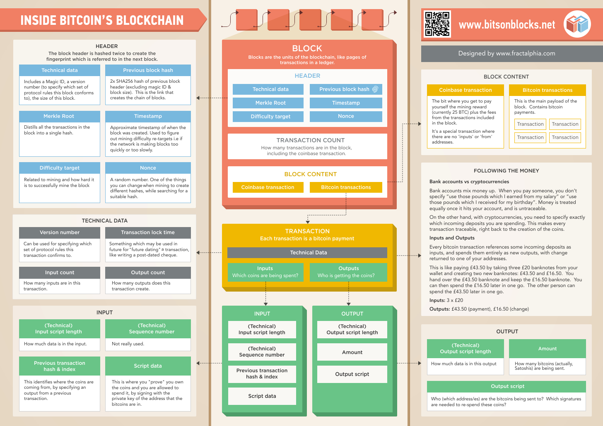

# CryptoClub
Journal club of blockchain whitepapers

## Infographics

[source](https://bitsonblocks.files.wordpress.com/2015/09/bitcoin_blockchain_infographic1.jpg)

## Papers

- [Satoshi Nakamoto whitepaper](PDFs/Bitcoin_A_Peer_to_Peer_Electronic_Cash_System.pdf)
- [IMB Blockchain for Dummies](PDFs/blockchain_for_dummies.PDF)
- [“MedRec” prototype for electronic health records and medical research data](PDFs/medrec.pdf)
- [Storj - A Peer-to-Peer Cloud Storage Network](PDFs/storj.pdf)

## Blogs

- [How the bitcoin protocol actually works](http://www.michaelnielsen.org/ddi/how-the-bitcoin-protocol-actually-works/)
